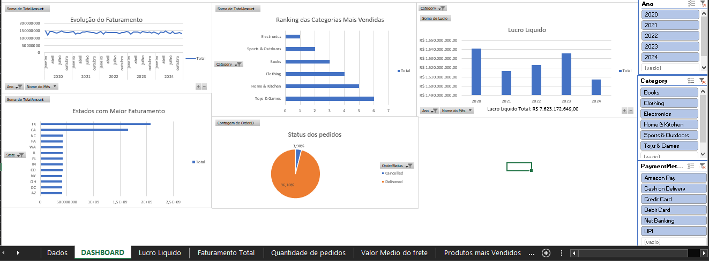

# Análise de Vendas Amazon - Dashboard Interativo no Excel

## 📌 Visão Geral
Este projeto analisa uma base de dados de 100.000 pedidos da Amazon para identificar padrões de faturamento, logística e comportamento regional. O objetivo foi transformar dados brutos em insights estratégicos para gestão de e-commerce.

## 🛠️ Ferramentas Utilizadas
* **Excel** (Motor principal)
* **Power Query** (ETL - Limpeza e Tratamento de dados)
* **Tabelas Dinâmicas** (Modelagem e Agregação)
* **Dashboard Interativo** (Visualização)

## 📊 Etapas do Projeto

### 1. Tratamento de Dados (ETL)
Utilizei o **Power Query** para garantir a integridade da análise:
* Conversão de tipos (Datas e Moedas).
* Criação da coluna de **Lucro** e **Mês/Ano**.

### 2. Análise de Negócio
Respondi a perguntas-chave como:
* **Faturamento Total:** R$ 8,31 bilhões identificados.
* **Logística:** Taxa de entrega de 96,1% vs 3,9% de cancelamentos.
* **Geografia:** Identificação de CA e TX como os estados com maior volume.

### 3. Dashboard Interativo
Desenvolvi um painel visual que permite filtrar as métricas por categoria de produto, método de pagamento e período temporal.

## 📈 Insights Principais
* O faturamento mantém-se estável ano a ano (~R$ 1,5B), mas há picos sazonais que podem ser explorados em marketing.
* O custo médio de frete é de R$ 674,74, um KPI crítico para a margem de lucro.

## 📂 Como visualizar
1. Baixe o arquivo `Projeto Analise de Vendas Amazon.xlsx` presente neste repositório.
2. Certifique-se de habilitar as macros/conteúdo caso o Excel solicite.

.
.
